# [Unmixing Convolutional Features for Crisp Edge Detection]()

## Requirements
pytorch >= 1.0
torchvision
opencv-python
tqdm

## Training  & Testing

### Pretrained Models
- Download the pretrained model and unzip the model to **"./pretrained/"**
- [Pretrained model for BSDS500](https://drive.google.com/file/d/1xWYCKjdJTzSREYC9DHbUfZLViOf2CaME/view?usp=sharing)
- [Pretrained model for NYUDv2](https://drive.google.com/file/d/11DuMk38ZcPnnBuyP_ukpGODHJQkI5p-7/view?usp=sharing)

### Testing Data Preparation
- Download the test data for  [BSDS500 dataset and the NYUDv2 dataset](https://drive.google.com/file/d/1AqD3q-xeTD_HNh4wzDVvU3rXTAF9qRu_/view?usp=sharing).
- Place the images to "./data/.
- The default testing data is BSDS500. For getting the inference results of NYUDv2 dataset, one can change the 8th line in configs/__init__.py as follows.
```python
class Config(object):
    def __init__(self):
        self.data = "nyud"
```

The structure of the data folder should be
```shell
./data
   bsds/test/*
   bsds/train/*
   bsds/test.lst
   bsds/train.lst
   ------------------------
   nyud/test/*
   nyud/train/*
   nyud/test.lst
   nyud/train.lst
```

### Testing

```shell
python main.py --mode test
```

The output results will be saved to ./output/$dataset_name/single_scale_test/

### Training

```shell
python main.py --mode train
```
The training data will be updated soon.


## Visualization Results
### BSDS500

| Img                                 | GT                                 | [HED](https://openaccess.thecvf.com/content_iccv_2015/papers/Xie_Holistically-Nested_Edge_Detection_ICCV_2015_paper.pdf) | [RCF](http://mftp.mmcheng.net/Papers/19PamiEdge.pdf) | [BDCN](https://arxiv.org/pdf/1902.10903.pdf) | CATS(Ours)                           |
| :---------------------------------: | :--------------------------------: | :---------------------------------: | :---------------------------------: | :----------------------------------: | :----------------------------------: |
|   |   | 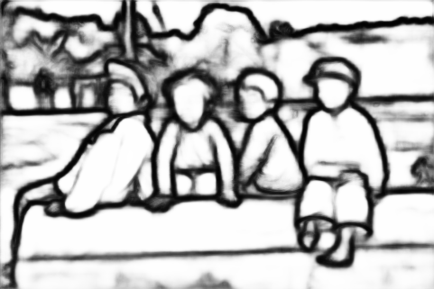  | 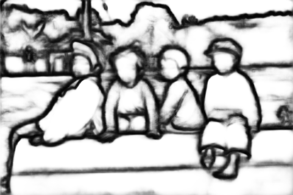  | 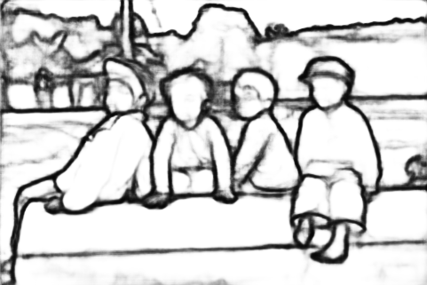  | 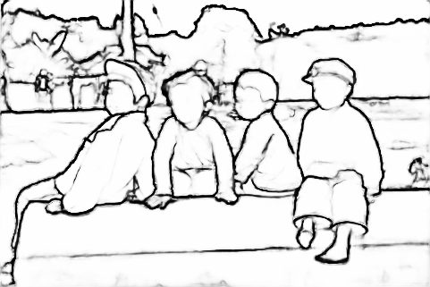  |
|  | 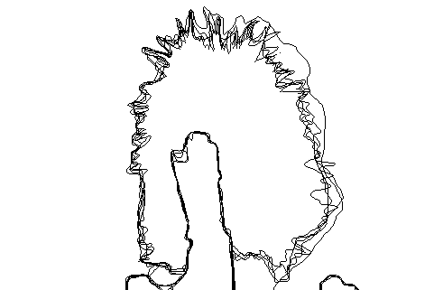 | 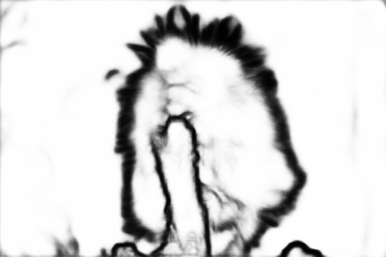 | 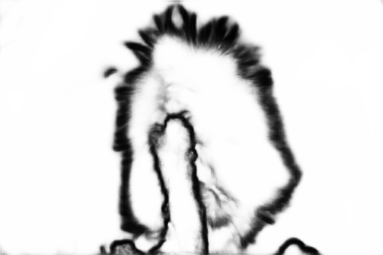 | 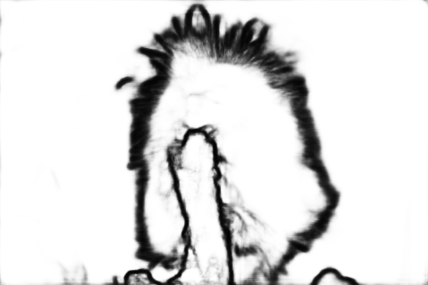 | 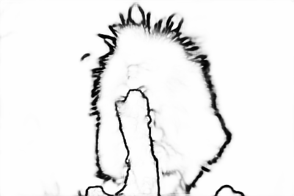 |
|   | 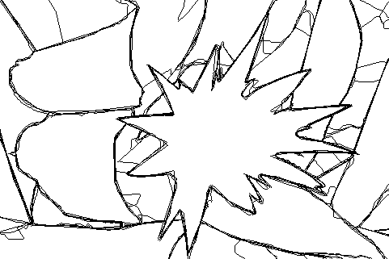  | 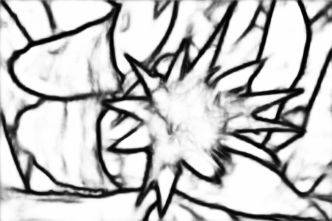  | 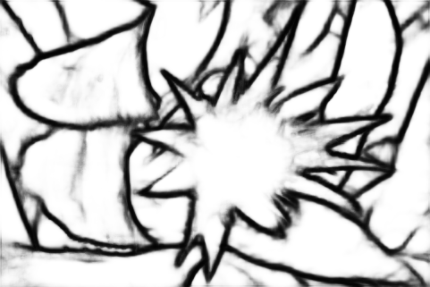  | 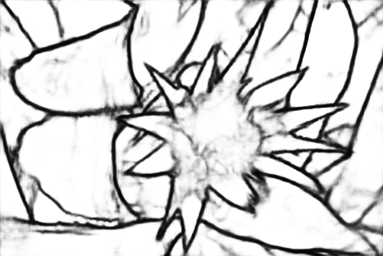  | 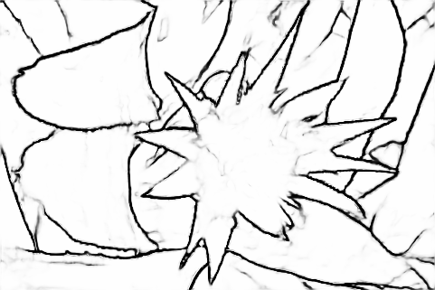   |
|  | 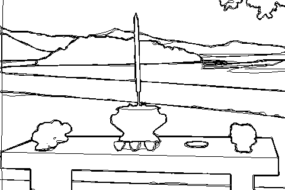 |  | 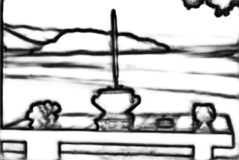 | 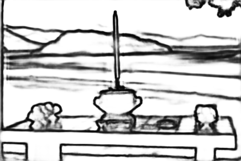 |   |
|  | 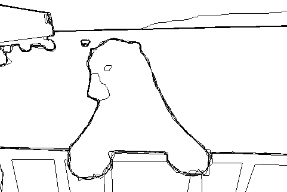 | 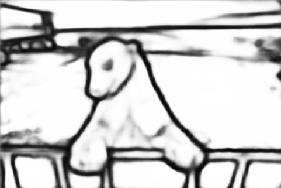 | 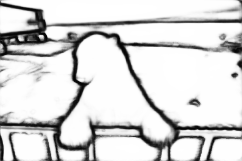 | 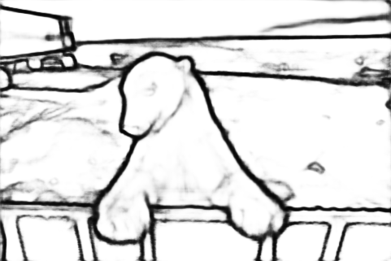 | 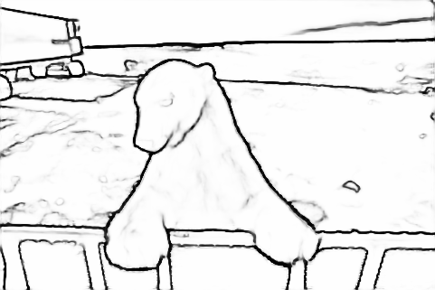 |


### NYUDv2

|                 Img                 |                 GT                 | [HED](https://openaccess.thecvf.com/content_iccv_2015/papers/Xie_Holistically-Nested_Edge_Detection_ICCV_2015_paper.pdf) | [RCF](http://mftp.mmcheng.net/Papers/19PamiEdge.pdf) | [BDCN](https://arxiv.org/pdf/1902.10903.pdf) |              CATS(Ours)              |
| :---------------------------------: | :--------------------------------: | :----------------------------------------------------------: | :--------------------------------------------------: | :------------------------------------------: | :----------------------------------: |
|   | 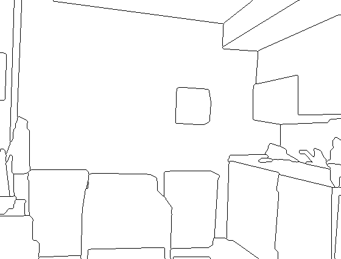  |              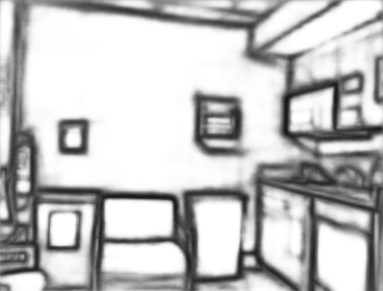              |          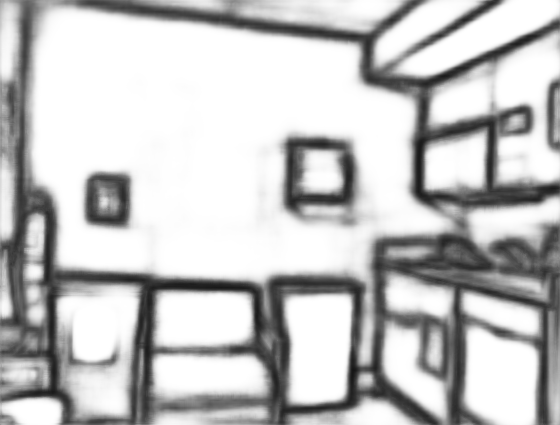          |     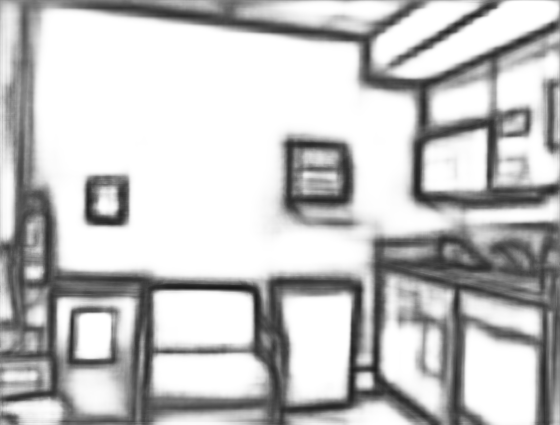      | 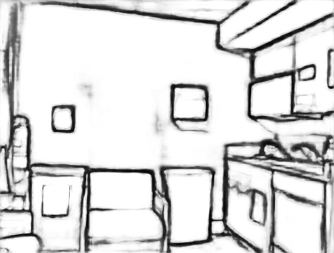  |
| 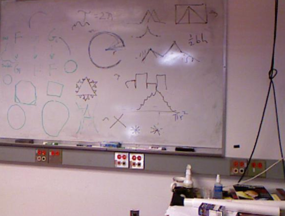 | 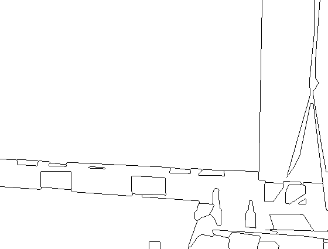 |             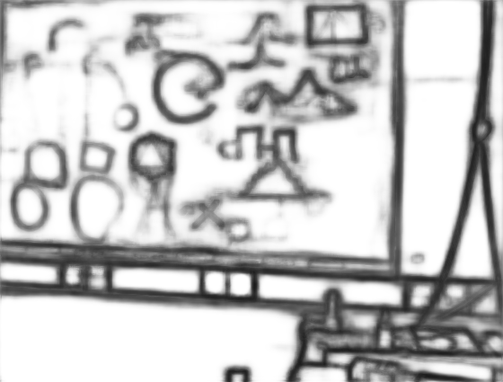              |         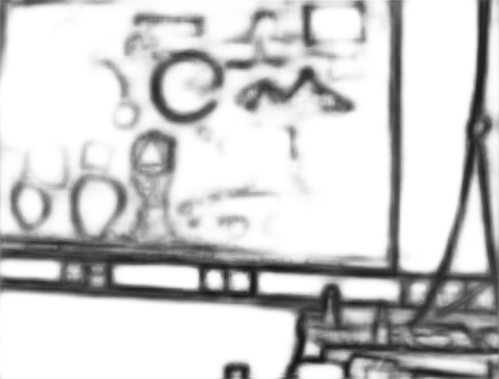          |     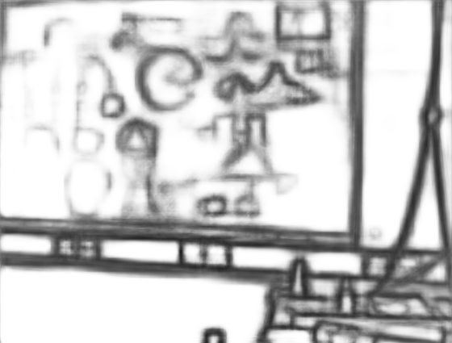     | 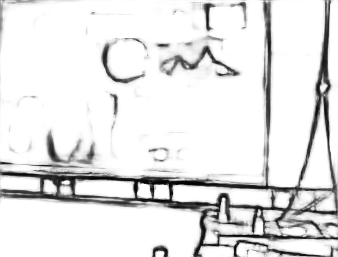 |
|   | 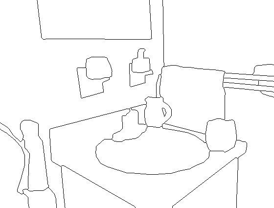  |              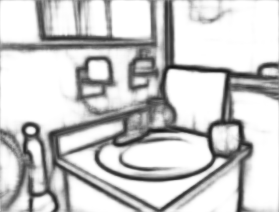              |          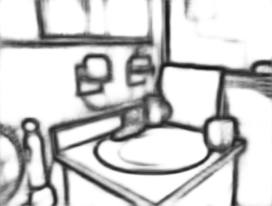          |     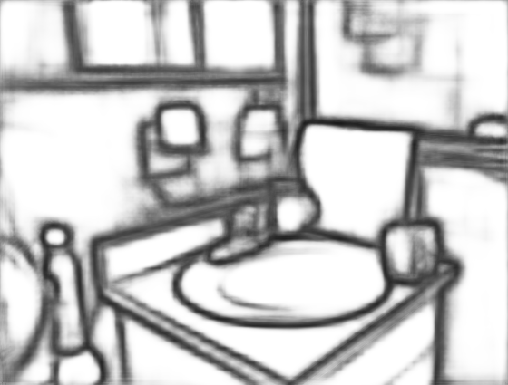      | 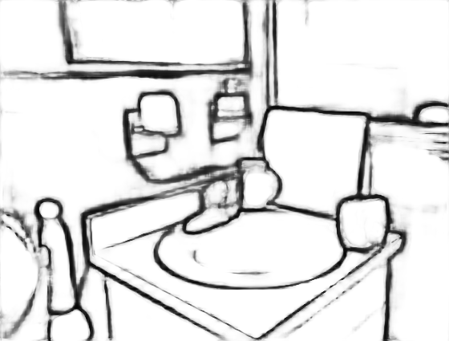  |
| 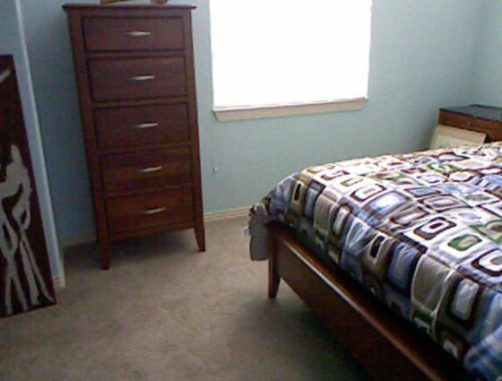 | 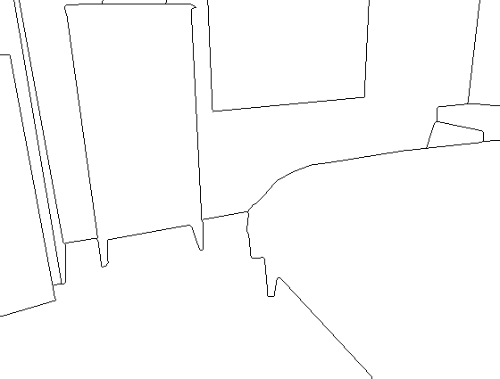 |             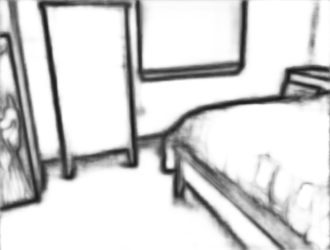              |         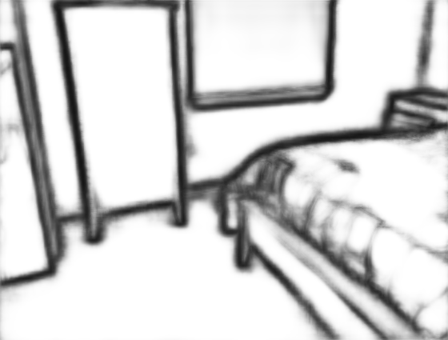          |     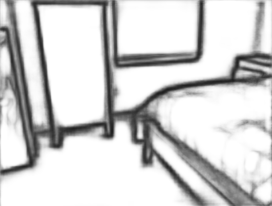     | 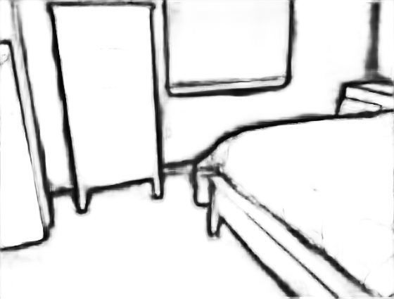 |
|  | 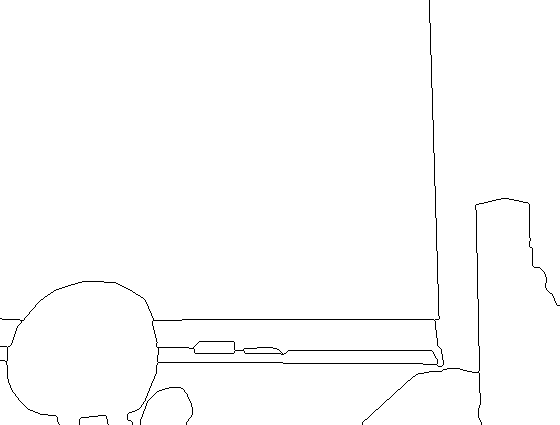 |             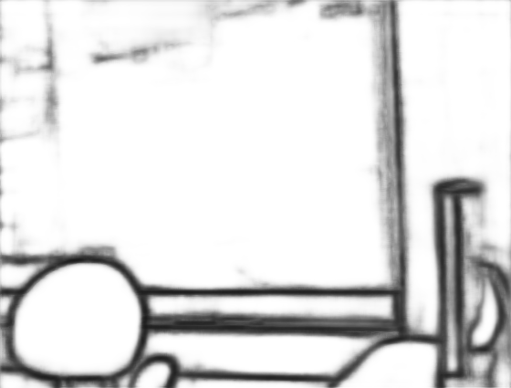              |         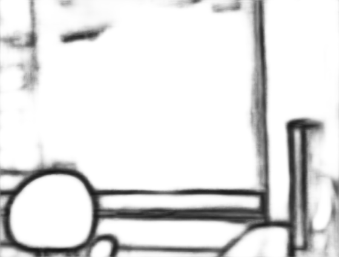          |     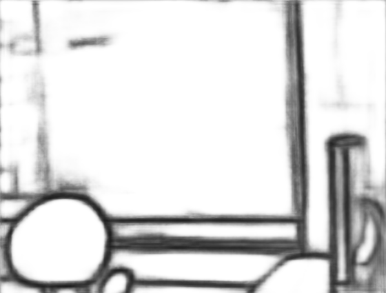     |  |
